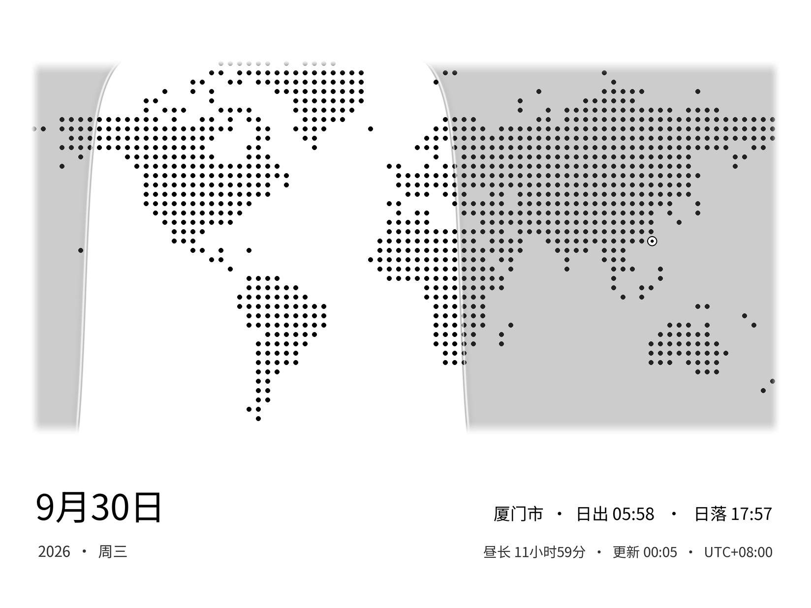
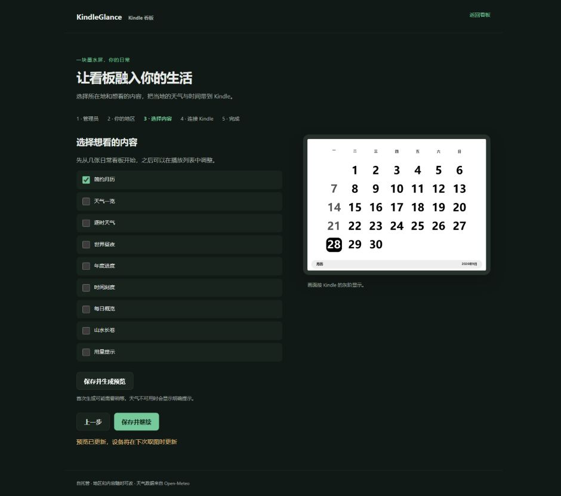

# KindleGlance · Kindle 看板

把闲置 Kindle 变成天气、日历和生活进度看板。服务端生成灰阶图片，KOReader 插件负责定时取图与省电显示。

**当前为开源候选版 `v0.2.0-rc.1`。** 地区、时区和首次设置已实现；设备基线是 KPW11 / KOReader v2026.07.1。新 TLS 与长期休眠还需要真机验证，请先阅读 [兼容范围](docs/COMPATIBILITY.md)。



## 包含什么

- 九类内容：每日概览、天气一览、逐时天气、简约月历、世界昼夜、山水长卷、年度进度、时间刻度、可选 Codex 用量。
- 手机和桌面管理端：首次设置、地区搜索 / 手填、时区、播放列表、预览与设备连接。
- 设置持久化、旧配置迁移、缓存版本隔离、摄氏 / 华氏、周起始日、12 / 24 小时制。
- Kindle 插件：RTC 定时唤醒取图后关闭 Wi-Fi 休眠，也支持保持联网的常驻模式。
- KUAL A / B 启动入口：普通阅读模式与看板 no framework 模式，保留官方启动参数。
- 可选账号采集器：四个 Codex 账号、官方设备码授权、用量同步与人工订阅到期日期。

## 快速开始

安装 Docker 和 Compose v2，下载源码或部署包，在根目录执行：

```sh
docker compose up -d --build
docker compose exec board python -m app.manage setup-code
```

打开 `http://localhost:3001/admin`，用一次性初始化码建立管理员，然后选择地区、内容与设备连接。默认仅监听本机，局域网与 VPS 安装见 [安装指南](docs/INSTALL.md)。不需要作者账号或域名，也不要求安装 Codex 采集器。

## 设备安装

从 [Releases](https://github.com/jijuwen/kindle-glance/releases) 下载插件 ZIP 和启动入口 ZIP，分别把 `koreader/` 与 `extensions/` 合并到 Kindle 根目录。先备份并正常退出 KOReader，保留已有设置。

KUAL → KindleGlance → **B - Dashboard (no framework)** → KOReader 工具 → Kindle 看板 → 开始看板。A 为普通阅读入口；B 不自动进入看板。停止看板后仍在 KOReader，正常退出 KOReader 才恢复原生界面。

## 架构与资料

`浏览器 → 服务端配置 / 渲染 ← 天气源与可选采集器`，`Kindle 插件 → 鉴权 API → 灰阶图片`。单管理员、一个全局地区和播放列表、单 Uvicorn worker。运行数据与授权不进入源码仓库。

```text
kindle-display/          服务端、管理页面、设置与九类渲染
kindle-plugin/           KOReader 插件和 Lua 回归测试
kindle-launcher-ab/      A/B KUAL 菜单与构建器
tools/codex-collector/   可选账号授权及用量采集
tools/                  公开清单、构建与安装验证
docs/                   规划、进度、安装、升级及兼容范围
previews/               静态示例与设置页面截图
.github/                CI、Issue 与 PR 模板
compose.yaml            基础部署
compose.codex.yaml      可选采集器覆盖配置
```



- [安装](docs/INSTALL.md) · [配置与数据流](docs/CONFIGURATION.md)
- [升级 / 备份 / 回退 / 卸载](docs/UPGRADING.md) · [故障处理](docs/TROUBLESHOOTING.md)
- [开源规划](docs/OPEN_SOURCE_PLAN.md) · [实施进度](docs/IMPLEMENTATION_STATUS.md)
- [兼容与验收](docs/COMPATIBILITY.md) · [贡献指南](CONTRIBUTING.md) · [安全说明](SECURITY.md)

自有代码采用 MIT。第三方插件基础、AGPL 测试夹具、字体、山水与地图资源保留各自许可证，见 [第三方说明](THIRD_PARTY_NOTICES.md)。天气来源为 Open-Meteo，部署者须遵守其服务使用条件。
