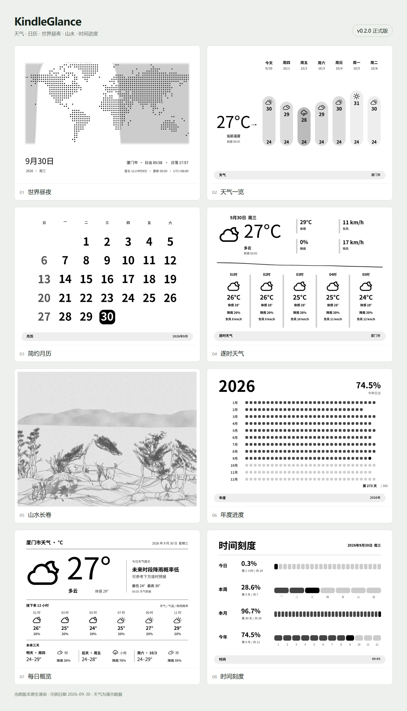

# 看板示例

下方拼图保留正式版 v0.2.0 的八种看板，示例日期为 2026-09-30，地区为厦门市，时区为 Asia/Shanghai。天气使用固定演示数据，不是实时预报；图片为原生渲染，不是真机实拍。不发布个人账号用量截图。



| 看板 | 原图 |
|---|---|
| 世界昼夜 | [day-night.png](day-night.png) |
| 天气一览 | [weather-glance.png](weather-glance.png) |
| 简约月历 | [simple-calendar.png](simple-calendar.png) |
| 逐时天气 | [hourly-weather.png](hourly-weather.png) |
| 山水长卷 | [shan-shui.png](shan-shui.png) |
| 年度进度（2026-10-02 新布局） | [year-progress.png](year-progress.png) |
| 年度花园（2026-10-02 新增） | [annual-garden.png](annual-garden.png) |
| 每日概览 | [daily-overview.png](daily-overview.png) |
| 时间刻度 | [time-scales.png](time-scales.png) |

年度进度和年度花园单图由 2026-10-02 当前源码重新生成，原生横屏 1648×1236；花园使用固定公开示例种子，与私人安装实例无关。参数见 [selected-render-manifest.json](selected-render-manifest.json)。上方历史拼图仍保留原年度进度，不包含年度花园。

`setup-desktop.png` 来自 v0.2.0 隔离测试实例的日常设置，使用保留示例域名，没有显示设备码或账号资料。

安装服务端依赖、中文字体与 Chromium 后，在项目根目录运行：

```sh
python tools/render_public_previews.py --at 2026-09-30T00:05:00+08:00
```

当前脚本使用临时数据目录、当前渲染函数与真实管理页面生成九种公开看板（另有可选 Codex 用量页），以 HTML 网格组合原图。运行会更新完整画廊和 [render-manifest.json](render-manifest.json)；仓库现有完整清单仍对应 v0.2.0 的历史生成结果。Windows 可用 FONT_PATH、FONT_BOLD_PATH 指定中文字体。

只重新生成本次两个日期看板、不启动管理端或拼图浏览器：

```sh
python tools/render_public_previews.py --at 2026-10-02T12:00:00+08:00 --images-only --pages annual-garden year-progress
```
